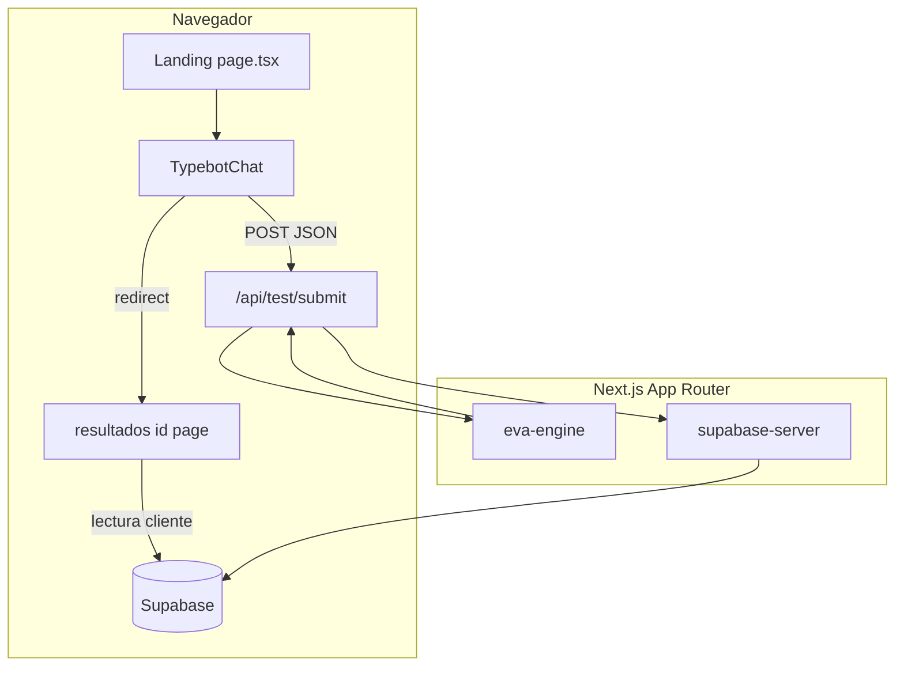

# Universidad Latino — Landing · Test vocacional EVA

Landing page interactiva para captación de prospectos: guía al estudiante desde el descubrimiento de su carrera hasta un **dictamen personalizado** con IA, integración con **Supabase** (CRM / leads) y beneficios según perfil (becas y descuentos en la página de resultados).

---

## Contenido de la landing (secciones)

La página principal (`/`) está construida como un único flujo vertical con las siguientes piezas:

| Orden | Sección                                   | Descripción                                                                                                                                                                                                                                   |
| ----- | ----------------------------------------- | --------------------------------------------------------------------------------------------------------------------------------------------------------------------------------------------------------------------------------------------- |
| 1     | **Header**                                | Logo institucional, navegación ligera y acción “Reiniciar Test” cuando aplica.                                                                                                                                                                |
| 2     | **Hero**                                  | Mensaje de admisión 2026, titular “Tu futuro COMIENZA AQUÍ”, texto de valor del test vocacional con IA y CTAs: **Solicitar Beca** (WhatsApp) e **Iniciar Test** (scroll suave a la sección del chat). Fondo con imagen + overlay azul marino. |
| 3     | **Oferta educativa**                      | Bloque “Excelencia Académica” / “Nuestra Oferta Educativa”: tarjetas por **sector** (Tecnología, Legal, Bienestar, Salud, Negocios) con licenciaturas, modalidades, sellos RVOE / titulación y enlace **Conocer más**.                        |
| 4     | **Modal licenciaturas**                   | Al pulsar “Conocer más”, overlay a pantalla completa con `iframe` del sitio oficial de licenciaturas y barra para volver o abrir en nueva pestaña.                                                                                            |
| 5     | **Registro y test (EVA)**                 | Sección `#chatbot-section`: panel izquierdo con beneficios (beca, perfil, horarios, WhatsApp) y panel derecho con **`TypebotChat`**: conversación guiada (Likert + texto), captura de contacto y envío al backend.                            |
| 6     | **Globales (fuera del scroll principal)** | **Widget de WhatsApp** flotante y, en desarrollo/edición visual, mensajería de **orchids-visual-edits**.                                                                                                                                      |

Tras completar el test, el usuario puede ir a **`/resultados/[id]`**, donde se muestra el dictamen, carreras sugeridas, modalidad, becas/descuentos y acciones (WhatsApp, PDF, etc.).

---

## Arquitectura



- **Cliente:** React 19, páginas con `"use client"` donde hace falta interactividad (landing, chat, resultados).
- **Servidor:** Ruta **`POST /api/test/submit`** ejecuta el motor **EVA**, persiste en **Supabase** (`leads`) con credenciales de servidor (`supabase-server.ts`) y, si existe `GHL_WEBHOOK_URL`, dispara webhook a CRM.
- **Datos:** Supabase (tabla `leads`, campos alineados al JSON del motor y al CRM). Variables públicas (`NEXT_PUBLIC_*`) para el cliente; clave **service role** solo en servidor para la API.

Rutas relevantes:

| Ruta               | Rol                                    |
| ------------------ | -------------------------------------- |
| `/`                | Landing + test incrustado              |
| `/resultados/[id]` | Dictamen y beneficios por `id` de lead |
| `/api/test/submit` | Procesamiento EVA + escritura Supabase |

---

## Diseño y marca

Criterios alineados a identidad **Universidad Latino** (institucional, legible, con microinteracciones suaves):

- **Azul marino** `#002D62` — fondos fuertes, textos de marca, iconografía sobre claros.
- **Dorado / amarillo institucional** `#E6B400` — CTAs, acentos, badges (contraste con texto azul marino en botones principales).
- **Gris de apoyo** `#F4F4F4` — sección del formulario / contraste con blanco.
- **Tarjetas** — bordes redondeados amplios (`rounded-3xl`, `rounded-[2rem]`), sombras suaves, hover con borde y sombra azul suave.
- **Tipografía** — `Poppins` / `Inter` vía `globals.css` y variables CSS; layout raíz también carga **Geist** para coherencia con el stack Next.
- **Iconos** — `lucide-react` en contenedores circulares o con fondo `#002D62` suavizado.
- **Motion** — `framer-motion` en componentes del chat y transiciones puntuales.

Logo en header y assets: almacenamiento **Supabase Storage** (URLs públicas); favicon: `src/app/icon.png` (escudo).

---

## Stack técnico

| Capa                                     | Tecnología                                                                                                          |
| ---------------------------------------- | ------------------------------------------------------------------------------------------------------------------- |
| Framework                                | **Next.js 15** (App Router)                                                                                         |
| Lenguaje                                 | **TypeScript**                                                                                                      |
| UI                                       | **React 19**, **Tailwind CSS 4** (`@tailwindcss/postcss`, `lightningcss`)                                           |
| Componentes UI base                      | **Radix UI**, **shadcn-style** (`src/components/ui`), **class-variance-authority**, **tailwind-merge**              |
| Iconos                                   | **lucide-react**                                                                                                    |
| Animación                                | **framer-motion**                                                                                                   |
| Backend datos                            | **Supabase** (`@supabase/supabase-js`) — cliente público en `lib/supabase.ts`, servidor en `lib/supabase-server.ts` |
| PDF / captura                            | **jspdf**, **html2canvas** (resultados)                                                                             |
| Formularios / validación (ecosistema UI) | **react-hook-form**, **zod**, **@hookform/resolvers**                                                               |
| Otros                                    | **next-themes**, **recharts** (si se usan gráficos en UI), **orchids-visual-edits** (entorno Orchids)               |

**Requisitos:** Node **≥ 20** (recomendado 20 LTS en producción / Nixpacks).

---

## Estructura del repositorio (resumen)

```
src/
  app/
    layout.tsx          # Metadata, fuentes, WhatsApp global, favicon
    page.tsx            # Landing: hero, oferta, sección test
    globals.css         # Tailwind 4 + tema + fuentes Google
    icon.png            # Favicon (escudo)
    api/test/submit/    # API del test
    resultados/[id]/    # Página de dictamen
  components/
    Header.tsx
    TypebotChat.tsx     # Flujo conversacional EVA + submit
    WhatsAppWidget.tsx
    ui/                 # Primitivos Radix/shadcn
  lib/
    supabase.ts         # Cliente browser (NEXT_PUBLIC_*)
    supabase-server.ts  # Cliente servidor (runtime, service role / anon)
    eva-engine.ts       # Lógica vocacional y scoring
```

Documentación operativa (WhatsApp, becas, precios, deploy **Easypanel**): **[CONFIGURACION.md](./CONFIGURACION.md)**.

---

## Scripts

```bash
npm install
npm run dev      # Next + Turbopack — http://localhost:3000
npm run build
npm run start    # Producción (tras build)
npm run lint
```

Variables de entorno: copia desde tu `.env` local; en producción configúralas en el panel (ver `CONFIGURACION.md`).

---

## Deploy

El flujo documentado para producción es **GitHub → Easypanel (VPS)** con Nixpacks (`npm install`, `npm run build`, `next start`). URL de referencia en documentación: **https://testunilatino.algorithmus.io/** (ajustar si cambia el dominio).

---

## Licencia y propiedad

Proyecto privado para **Universidad Latino**. El contenido académico y la marca son propiedad de la institución.
